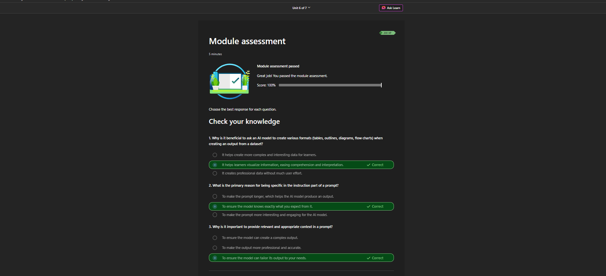
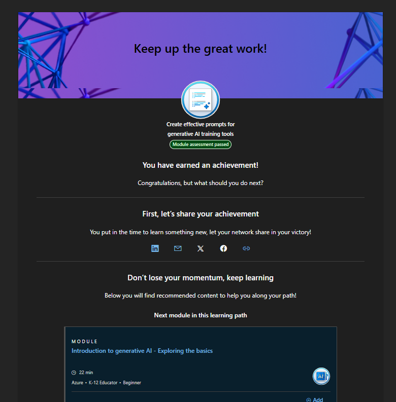

# Day 03 - Prompt Engineering for Generative AI

## Module Information

| Field | Details |
|---|---|
| Platform | Microsoft Learn |
| Module | Create effective prompts for generative AI training tools |
| Level | Beginner |
| Units | 7 |
| Status | Completed |
| Assessment Score | 100% |
| Learning Focus | Prompt engineering and practical SOC applications |

## Overview

This module introduced the foundations of prompt engineering and explained how clear instructions, relevant context, and appropriate output requirements improve the usefulness of generative AI responses.

I applied these concepts to cybersecurity and Tier 1 SOC workflows, including alert triage, authentication-log analysis, evidence extraction, severity assignment, investigation planning, and incident summarization.

## Learning Objectives

After completing this module, I can:

- explain what prompt engineering is and why it matters;
- distinguish between instructions and context;
- compare simple and complex prompt instructions;
- create clear, specific, and task-focused prompts;
- request outputs in tables, bullet points, timelines, and summaries;
- adjust responses for different audiences and levels of technical detail;
- identify the need to verify AI-generated security findings;
- apply prompt-engineering practices to SOC investigations.

## Unit Summary

### Unit 1 - Introduction

Generative AI models can produce text, images, code, and other outputs. A prompt is the interface through which a user communicates a task and expectations to the model.

Prompt engineering is the practice of designing instructions that guide a model toward a useful and relevant output.

> A longer prompt is not automatically a better prompt. A good prompt is clear, specific, relevant, and structured.

### Unit 2 - Prompt-Based Generative AI Models

A prompt-based model generates a response by predicting contextually appropriate tokens. It does not retrieve every answer from a fixed question-and-answer list.

This means a response may sound confident without being factually correct.

For security work, the practical rule is:

~~~text
AI analyzes.
The analyst verifies.
The analyst decides.
~~~

### Unit 3 - Instructions and Context

An effective prompt normally contains two core elements:

| Element | Purpose | SOC Example |
|---|---|---|
| Instruction | Defines the task and objective | Identify suspicious login activity and assign a severity level |
| Context | Provides relevant background and evidence | The user normally signs in from Pennsylvania, but this event occurred at 3:15 AM from a new external IP |

~~~text
Prompt = Instruction + Relevant Context
~~~

Useful SOC context may include:

- log source;
- timestamps and time zone;
- affected user and host;
- source and destination IP addresses;
- process, URL, domain, or file hash;
- normal baseline behavior;
- available and missing evidence;
- required output format.

### Unit 4 - Simple and Complex Instructions

A simple instruction asks for one broad action:

~~~text
Describe this log.
~~~

A complex instruction includes multiple relevant requirements:

~~~text
Act as a Tier 1 SOC Analyst.

Analyze this authentication log.

1. Determine whether the activity is suspicious.
2. Identify the source IP and affected user.
3. Assign a severity level and explain the reason.
4. Recommend the next investigation steps.
5. Finish with a short incident summary.
~~~

| Instruction Type | Characteristics | Likely Output |
|---|---|---|
| Simple | Short and broad | General and less controlled |
| Complex | Includes relevant requirements and structure | More specific and organized |

Complex instructions should remain relevant. Unnecessary or conflicting requirements can reduce output quality.

### Unit 5 - Creating Effective Prompts

#### Be Specific

Clearly state what the model should identify or produce.

~~~text
Identify the affected user, source IP, failed-login count,
successful-login event, severity, and supporting evidence.
~~~

#### Select an Appropriate Response Style

Security analysis usually requires factual, precise, and structured output rather than imaginative content.

#### Verify Factual Accuracy

AI-generated claims should be checked against:

- original logs;
- SIEM and EDR telemetry;
- identity-provider records;
- approved threat-intelligence sources;
- official vendor documentation;
- organizational policies and playbooks.

#### Customize the Audience

~~~text
Explain this alert to a beginner SOC analyst.
~~~

~~~text
Write a three-sentence executive summary for a manager.
~~~

#### Use a Fresh Context for Unrelated Tasks

A new investigation should begin with a clean context when the previous discussion concerns an unrelated case.

#### Specify Output Length and Format

~~~text
Summarize the alert in three bullet points.
~~~

Depending on the task, request a findings table, bullet list, event timeline, escalation note, or executive summary.

## Weak Prompt vs. Effective Prompt

### Weak Prompt

~~~text
Analyze this log.
~~~

The model does not know which indicators to identify, how to assess risk, or how to format the result.

### Effective SOC Prompt

~~~text
Act as a Tier 1 SOC Analyst.

Analyze the following Windows authentication log.

Identify:
- suspicious activity;
- source IP;
- affected account;
- failed and successful login events;
- severity level;
- supporting evidence;
- recommended next steps.

Present the findings in a table.
Separate confirmed facts from assumptions.
Do not invent missing information.
~~~

## Reusable SOC Prompt Template

~~~text
ROLE
Act as a Tier 1 SOC Analyst.

TASK
Analyze the following security alert or log.

CONTEXT AND EVIDENCE
Provide sanitized and authorized evidence.
Include timestamps and the correct time zone.

INVESTIGATION REQUIREMENTS
- Identify the affected user and host.
- Identify source and destination IP addresses.
- Identify relevant URLs, domains, hashes, or processes.
- Separate confirmed evidence from assumptions.
- Determine whether the activity is benign, suspicious, or malicious.
- Assign a severity level and explain the reason.
- Map to MITRE ATT&CK only when evidence supports it.
- Recommend immediate and follow-up actions.
- State what additional evidence is required.

OUTPUT FORMAT
1. Findings table
2. Short timeline
3. Recommended actions
4. Three-sentence incident summary

VERIFICATION RULE
Do not invent missing facts.
Mark uncertain claims as "Needs verification."
~~~

~~~text
Effective Security Prompt =
Role + Task + Evidence + Investigation Requirements
+ Output Format + Verification
~~~

## Practical SOC Example

### Evidence

~~~text
2026-08-10 03:14:51  Event ID 4625
User: j.smith
Source IP: 198.51.100.24

2026-08-10 03:15:02  Event ID 4625
User: j.smith
Source IP: 198.51.100.24

2026-08-10 03:15:18  Event ID 4624
User: j.smith
Source IP: 198.51.100.24

Baseline:
The user normally signs in between 9:00 AM and 5:00 PM
from Pennsylvania.
~~~

### Preliminary Findings

| Finding | Evidence | Assessment |
|---|---|---|
| Multiple failed logins | Two Event ID 4625 records | May indicate mistyped credentials or password guessing |
| Successful login after failures | Event ID 4624 | Increases concern, but logon type and authentication details are needed |
| Unusual time | 3:15 AM | Deviates from the stated user baseline |
| New external IP | 198.51.100.24 | IP reputation and related user activity require verification |
| Initial severity | Multiple suspicious indicators | Medium pending additional evidence |

### Recommended Investigation Steps

1. Confirm the time zone, logon type, and target host.
2. Review EDR and identity-provider telemetry for the same time window.
3. Check the IP address using approved reputation sources.
4. Review MFA results and impossible-travel alerts.
5. Search for password resets, privilege use, and lateral movement.
6. Escalate according to the organization's incident-response process if necessary.

The available evidence is suspicious, but it is not sufficient to confirm account compromise.

## Security and Privacy Considerations

Before providing data to an AI tool:

- follow the organization's acceptable-use and data-handling policies;
- remove passwords, API keys, tokens, and other secrets;
- sanitize personal and confidential information;
- use only authorized logs and evidence;
- avoid uploading sensitive data to unapproved public AI services.

AI output should support an investigation, not replace original evidence or human judgment.

## Assessment Review

| Concept | Correct Understanding |
|---|---|
| Varied output formats | Tables, outlines, diagrams, and flowcharts can improve comprehension and interpretation |
| Specific instructions | They help the model understand exactly what the user expects |
| Relevant context | It helps the model tailor the response to the user's needs |

**Assessment result: 100%**

## Evidence

Upload the screenshots to this folder using these filenames:

~~~text
Day_03_Assessment_100_Percent.png
Day_03_Completion.png
~~~

### Assessment

### Completion

## Key Takeaways

- Prompt quality strongly influences output usefulness.
- Effective prompts combine clear instructions with relevant context.
- Simple prompts are useful for broad tasks; complex prompts provide greater control.
- Output format and audience should be specified when they matter.
- AI-generated security findings must be verified against original evidence.
- Confirmed facts, assumptions, and missing information should be clearly separated.
- Human analysts remain responsible for final security decisions.

## Final Principle

~~~text
AI assists.
Evidence confirms.
The human analyst decides.
~~~

---

**Author:** MD Mostakim Hossain  
**Learning Track:** Cybersecurity + AI  
**Repository:** Cybersecurity-AI-Learning-Notes

