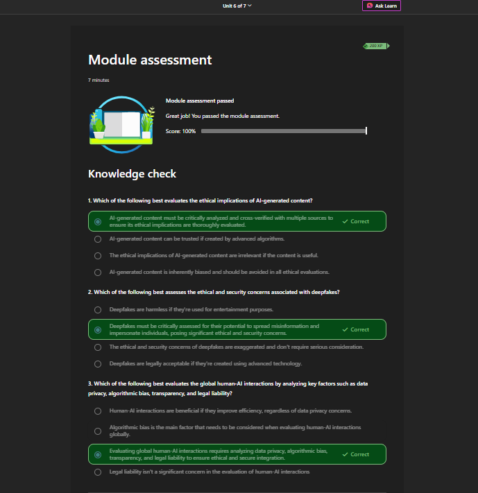
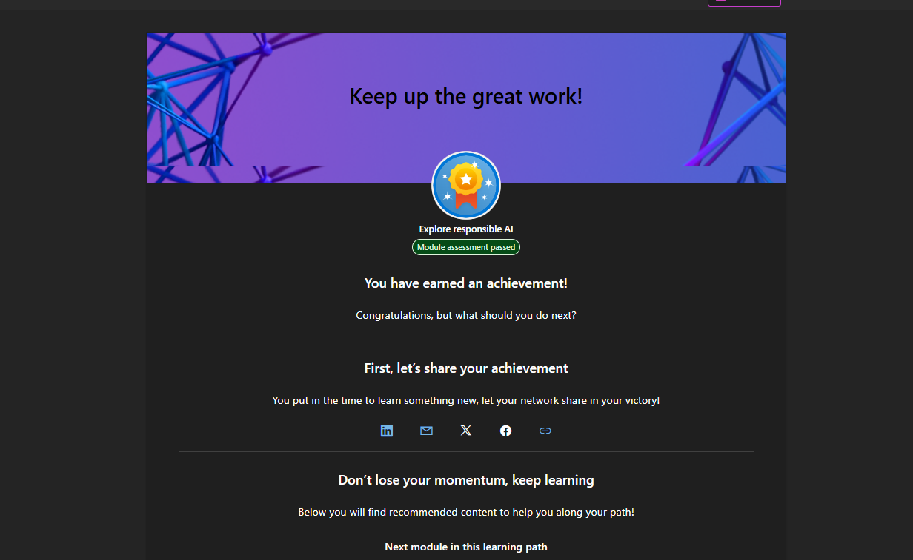

# Day 04 - Explore Responsible AI

## Module Information

| Field | Details |
|---|---|
| Platform | Microsoft Learn |
| Module | Explore responsible AI |
| Units | 7 |
| Status | Completed |
| Assessment Score | 100% |
| Learning Focus | Responsible AI, deepfakes, copyright, and human–AI interaction |

## Overview

This module explored how to use AI ethically, safely, and responsibly. It covered the six principles of responsible AI, methods for assessing AI-generated content, deepfake and copyright risks, and the global implications of human–AI interaction.

I connected these concepts to practical SOC workflows, where AI can support alert triage and investigation but must not replace evidence validation, organizational policy, approval, or human accountability.

## Learning Objectives

After completing this module, I can:

- critically evaluate and cross-verify AI-generated content;
- explain the six principles of responsible AI;
- recognize bias, privacy, safety, and transparency risks;
- identify common deepfake techniques and verification methods;
- apply copyright, licensing, attribution, and consent considerations;
- explain human-in-the-loop decision making;
- apply responsible AI practices to SOC investigations.

## Six Principles of Responsible AI

| Principle | Practical Meaning | SOC Application |
|---|---|---|
| Accountability | People remain responsible for AI-assisted decisions | Record who verified and approved an action |
| Inclusiveness | AI should benefit and remain accessible to diverse users | Test across languages, abilities, and user groups |
| Reliability & Safety | AI should be tested, monitored, and fail safely | Use validation, monitoring, rollback, and human override |
| Fairness | AI should not create unjustified unequal outcomes | Review risk scoring for demographic or regional bias |
| Transparency | Users should understand when and how AI is used | Label AI-assisted findings and document supporting evidence |
| Privacy & Security | Data and systems must be protected | Minimize, redact, encrypt, and restrict sensitive data |

## Unit Summary

### Unit 1 - Introduction

AI-generated content can appear authentic while being misleading or fabricated. High-impact content should be critically analyzed and cross-verified with multiple reliable sources before it is trusted or shared.

### Unit 2 - Using AI Responsibly: Best Practices

Responsible use requires understanding AI limitations, recognizing blind spots, protecting privacy, cross-verifying output, following organizational policy, and refining inaccurate or incomplete results.

### Unit 3 - Principles of Responsible AI

Trustworthy AI is built on accountability, inclusiveness, reliability and safety, fairness, transparency, and privacy and security.

### Unit 4 - Deepfakes and Copyright in AI

Deepfakes can imitate faces, voices, and events. Verification should combine source analysis, cross-checking, metadata and provenance review, visual/audio inspection, and direct confirmation through trusted channels. Detector scores alone are not conclusive evidence.

Copyright considerations include ownership, licensing, attribution, and consent. Online availability does not automatically grant permission to reuse content.

### Unit 5 - Human–AI Interaction and Global Implications

Responsible AI deployment requires data privacy, bias testing, transparency, legal accountability, digital education, workforce upskilling, advisory oversight, and appropriate government engagement.

## Responsible SOC Workflow

~~~text
Security Evidence
      ↓
AI-assisted analysis
      ↓
Human verification and correlation
      ↓
Policy and approval check
      ↓
Human action and documentation
~~~

AI output is not verified evidence. A SOC analyst should correlate findings with original logs, SIEM, EDR, firewall telemetry, identity records, approved threat intelligence, and organizational playbooks.

## Practical Example: AI Flags a Malicious IP

Before blocking the IP, an analyst should:

1. inspect the original alert and timestamps;
2. identify affected users, hosts, and business assets;
3. correlate firewall, EDR, and authentication events;
4. check approved threat-intelligence sources;
5. confirm it is not an internal scanner, VPN, allowlisted service, or shared infrastructure;
6. assess confidence, impact, and false-positive risk;
7. follow the response playbook and approval process;
8. document the final decision and supporting evidence.

## Deepfake Verification Checklist

- identify the earliest available source;
- check official accounts and trusted reporting;
- use reverse image or keyframe search;
- inspect metadata and content provenance when available;
- review visual, lip-sync, and audio inconsistencies;
- verify urgent instructions through a trusted secondary channel;
- preserve the original file, hash, source, and timeline;
- escalate according to the incident-response process.

## Data Protection Rules

- Use only authorized AI tools.
- Do not submit passwords, API keys, personal data, customer records, confidential logs, or unrestricted evidence to public AI systems.
- Apply data minimization, redaction, access control, and retention requirements.
- Separate confirmed facts, assumptions, and items that need verification.

## Key Lessons

~~~text
AI assists.
The analyst verifies.
Policy authorizes.
The human decides and remains accountable.
~~~

## Evidence of Completion

### Assessment - 100%

### Module Completion

## Skills Demonstrated

- Responsible AI principles
- AI-output verification
- Deepfake awareness and evidence handling
- Privacy and security risk assessment
- Bias and fairness awareness
- Human-in-the-loop decision making
- SOC-oriented AI governance

## Author

**MD Mostakim Hossain**  
Cybersecurity and AI learner focused on SOC operations, incident response, and responsible security automation.

---

> This repository documents my learning journey. Examples are for defensive education and authorized lab use only.
